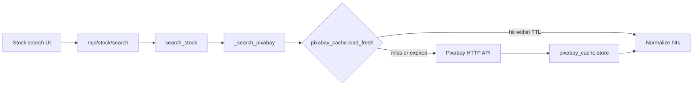

# Pixabay 24-hour API cache — status and suggested changes

## Requirement (from [Pixabay API docs](https://pixabay.com/api/docs/))

> To keep the Pixabay API fast for everyone, **requests must be cached for 24 hours**.

Also relevant: `webformatURL` values are valid for ~24 hours, and permanent hotlinking is forbidden (download into the project on import — already how “Add to project” works).

## Already implemented

The stock-lock-down work already covers this. No greenfield cache is needed.

| Piece | Location |
| --- | --- |
| Disk cache module | [`src/content_sprout/pixabay_cache.py`](src/content_sprout/pixabay_cache.py) |
| Search wiring | [`_search_pixabay`](src/content_sprout/stock_media.py) — load before HTTP, store after |
| Default TTL 24h | [`StockMediaConfig.pixabay_cache_ttl_hours`](src/content_sprout/config.py) + [`config.yaml`](config.yaml) |
| API passes `cache_dir` | [`web.py` `/api/stock/search`](src/content_sprout/web.py) |
| Tests | [`tests/test_pixabay_cache.py`](tests/test_pixabay_cache.py) |

**Cache key:** `media_type + query + page + page_size + sha256(api_key)[:16]` → `{cache_dir}/pixabay_api/{sha256}.json` with `fetched_at`, `expires_at`, and full JSON `response` (hits + metadata).

**Intentionally not cached:** binary downloads via `fetch_remote_bytes` (those become project assets). Openverse is out of scope for this Pixabay rule.

## Remaining gaps worth fixing

These are the meaningful follow-ups — the core compliance path already works.

1. **Enforce TTL floor of 24 hours**  
   [`save_stock_media_settings`](src/content_sprout/config.py) currently allows `max(0.1, …)`, so a config of `1` would violate Pixabay. Clamp to `max(24.0, …)` (and treat missing/`0` as 24). Optionally reject values below 24 in `/api/stock/...` settings if exposed.

2. **Prune expired entries**  
   Expired files are ignored on read but left on disk. Add a lightweight prune (e.g. on store, or occasionally from search) that deletes `{cache_dir}/pixabay_api/*.json` where `expires_at < now`.

3. **Do not add a within-TTL force-refresh**  
   A “Refresh results” button that re-hits Pixabay for the same query/page within 24h would break the requirement. Keep refresh = re-read cache until expiry.

4. **Optional observability (low priority)**  
   Return `pixabay_cache: "hit" | "miss"` on `/api/stock/search` for debugging only; not required for compliance.

## Out of scope

- Caching Openverse the same way
- Caching CDN binary bytes for browse thumbs (Pixabay asks to cache **API responses/metadata**; imported assets are already downloaded locally)
- Changing rate limits or attribution UI (attribution when showing results is a separate Pixabay request and already partially handled via `page_url` / `attribution` on `StockItem`)

## Recommended next step

If you want code changes, implement items **1** and **2** only — small, compliance-hardening edits with a couple of unit tests. Items 3–4 are policy/guidance, not large builds.
