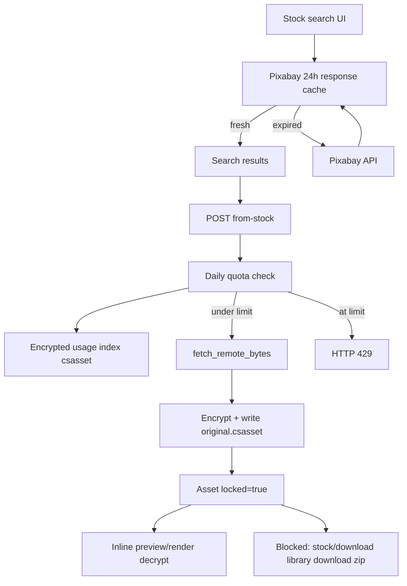

# Stock asset lock-down and daily limits

## Goals

- **Stronger lock-down:** Stock imports (Pixabay/Openverse via “Add to project”) are encrypted at rest and cannot be saved as plaintext via browser Download, library Download, or project zip.
- **Daily quota:** Default **20** stock fetches per calendar day (local app clock), configurable in Settings.
- **Encrypted usage index:** The per-day download count/history file is encrypted at rest so date and count cannot be casually edited as plaintext.
- **Pixabay 24h API cache:** Search API responses and metadata are cached for **24 hours** (Pixabay API docs), then refreshed on the next matching request.

Honest limit: this deters casual abuse and Finder/export exfiltration. A determined local user who reverse-engineers the key (or deletes the usage file / key) can still bypass; the daily quota plus encrypted index raise the bar against bulk Pixabay CDN use and casual counter resets.

## Architecture

## 1. Daily download limit (default 20)

**Config** — extend [`StockMediaConfig`](src/content_sprout/config.py):

- `daily_download_limit: int = 20` (`0` = unlimited)
- Persist via existing `save_stock_media_settings` / Settings GET+PUT

**Usage store** — [`stock_quota.py`](src/content_sprout/stock_quota.py):

- Encrypted file: `{cache_dir}/stock_download_usage.csasset`
- Payload (after decrypt): `{ "date": "YYYY-MM-DD", "count": N }`
- Same app key as locked assets (`stock_asset.key` via `asset_crypto`)
- Format: `CSASSET1` + Fernet ciphertext (not editable as JSON in a text editor)
- Atomic write (temp file + replace); `0600` permissions
- Reset when calendar date rolls (local app clock)
- Legacy plaintext `{cache_dir}/stock_download_usage.json` is migrated once to `.csasset` then removed
- **Tamper / corrupt file:** fail closed for the day (treat as limit already reached) so gibberish writes cannot reset the counter
- Shared gate used by stock import

**API**

- Before `POST .../assets/from-stock`: check quota → **429** with message like `Daily stock download limit reached (20/20). Resets at midnight.`
- Consume only after a successful remote fetch
- Expose remaining count on `GET /api/stock/settings` and/or `GET /api/stock/capabilities` for UI

**UI** ([`index.html`](src/content_sprout/static/index.html) + [`app.js`](src/content_sprout/static/app.js))

- Settings: number input for daily limit (default 20) + “used today / remaining”
- Free-assets import: toast on 429; optionally disable Import when remaining is 0

## 2. Remove plaintext stock export paths

| Path | Change |
|------|--------|
| `GET /api/stock/download` | Return **403** — no browser save of remote stock bytes |
| Free-assets UI “Download” button | Remove; keep only “Add to project” |
| `GET .../assets/{id}/download` | **403** if `asset.locked` |
| `GET .../assets/zip` | Skip locked assets; if none left, 404 with clear detail |
| Palette / library download buttons | Hide for `locked` assets |

Preview/timeline still use inline file URLs (decrypt on serve — below). Composed post **exports** (user’s rendered output) stay allowed; only the stock original is locked.

## 3. App-only encryption at rest

**Dependency:** add `cryptography` to [`pyproject.toml`](pyproject.toml).

**New module** `asset_crypto.py`:

- Magic header `CSASSET1` + Fernet ciphertext
- App key: `{cache_dir}/stock_asset.key` (32 random bytes, created once, `0600`)
- `encrypt_bytes` / `decrypt_bytes` / `is_encrypted_blob`
- `materialize_path(path) -> Path`: if encrypted, write decrypted temp under `{cache_dir}/decrypted/` (unique name) for ffmpeg/Pillow; callers delete or use a short-lived context manager

**Also encrypts the quota usage index** (same key / magic) — see §1.

**Asset model** ([`models.py`](src/content_sprout/models.py)):

- `locked: bool = False`
- `source: str = ""` (e.g. `pixabay`, `openverse`) — set at import; used for UI badge + lock inheritance

**Write path** — [`ProjectStore.add_asset`](src/content_sprout/projects.py):

- Add `locked: bool = False`, `source: str = ""`
- When `locked`, write encrypted bytes as `original.csasset` (or keep extension and encrypt payload — prefer **`.csasset`** so Finder won’t open as media)
- Probe duration/size **before** encrypt (on plaintext bytes)

**Import** — [`import_stock_asset`](src/content_sprout/web.py):

- After quota + `fetch_remote_bytes`, call `add_asset(..., locked=True, source=...)`

**Read path**

- Central helper used by file endpoints, crop/process, video edit, `asset_describe`, `render.py`: open via decrypt / `materialize_path` when file is encrypted or `asset.locked`
- Inline serve (`/file`, asset preview): return **decrypted** bytes with `Content-Disposition: inline` only — never `attachment` for locked assets
- Derivatives (crop, process, video edit) of locked parents: new assets inherit `locked=True` and are stored encrypted

**Block re-upload:** stock contributor upload for `locked` assets → 403 (do not re-upload Pixabay content to other sites).

## 4. Pixabay 24-hour API response cache

Pixabay API docs: *“requests must be cached for 24 hours.”* Also, returned media URLs are typically valid for ~24 hours, so cached metadata stays coherent with CDN links for that window.

**Module** — [`pixabay_cache.py`](src/content_sprout/pixabay_cache.py):

- Store under `{cache_dir}/pixabay_api/{sha256}.json`
- Cache key: media type + query + page + page_size + hash of API key (key itself not stored in the filename)
- Entry fields: `fetched_at`, `expires_at`, `ttl_hours`, `media_type`, `query`, `page`, `page_size`, `response` (raw Pixabay JSON including hits/metadata)
- Default TTL: **24 hours** (`StockMediaConfig.pixabay_cache_ttl_hours`)
- On search: serve cached `response` if `now < expires_at`; otherwise call Pixabay and overwrite the entry
- Wired through [`_search_pixabay`](src/content_sprout/stock_media.py) / [`search_stock`](src/content_sprout/stock_media.py) with `cache_dir` from app config

**Does not cache:** binary media downloads (`fetch_remote_bytes`) — those become locked project assets. Openverse searches are out of scope for this Pixabay-specific rule.

## 5. Tests

- Quota: under limit allows; at 20 returns 429; date rollover resets
- Quota index: on-disk file is encrypted (`CSASSET1`); tamper fails closed; legacy plaintext JSON migrates to `.csasset`
- Crypto: round-trip encrypt/decrypt; `is_encrypted` detection
- Lock-down: `from-stock` sets `locked`; `/stock/download` 403; asset download 403; zip omits locked; preview/file still returns media bytes
- Inheritance: crop/process from locked → locked child
- Pixabay cache: hit within TTL skips network; expired entry refreshes; keys isolate query/API key

## Out of scope

- Encrypting user-uploaded (non-stock) assets
- OS keychain / machine-bound keys (file-based key in data dir is enough for this deterrence model)
- Preventing quota reset by deleting the usage file or key (encryption stops casual edits, not local wipe)
- Caching Openverse responses under the same 24h rule (Pixabay-specific requirement)
- Changing Pixabay’s own API rate limits (external)
