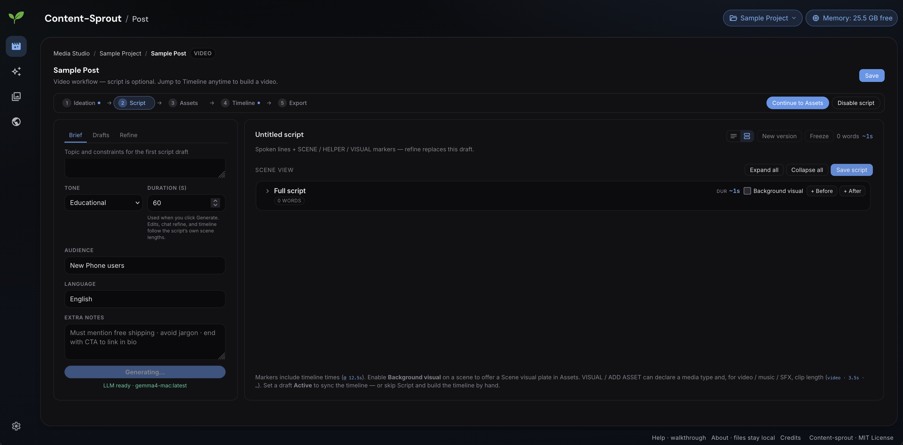
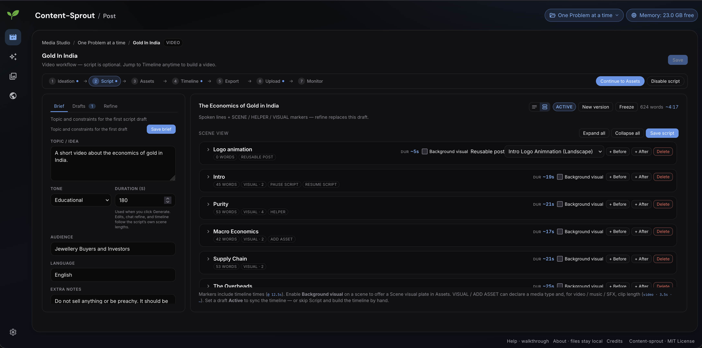
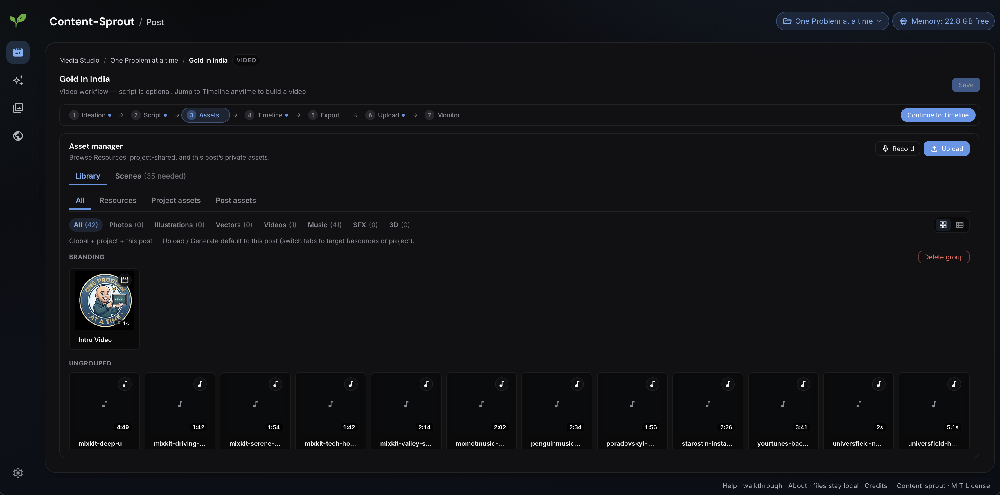
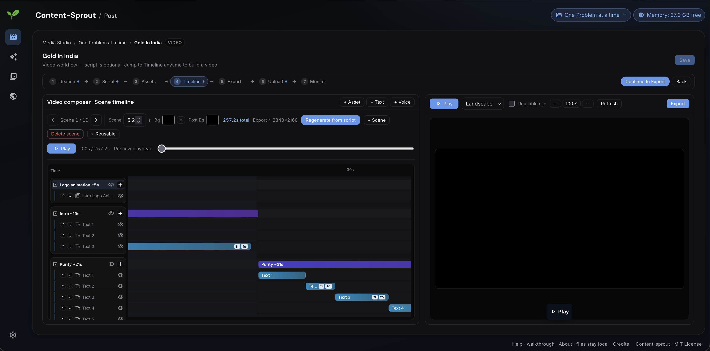
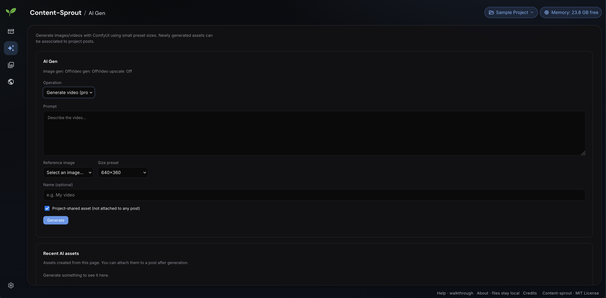

# Content-Sprout

**Free and open-source** desktop studio for social content — one workspace for assets, compose, voiceover, export, and multi-platform publish.

Most creator tools lock features behind SaaS paywalls, stamp watermarks, or force cloud uploads. Content-Sprout consolidates roughly a dozen single-purpose apps into one local UI that respects privacy and wallets. Setup takes a bit up front; after that the multi-platform pipeline is seamless. Core editing never requires a subscription or a cloud account.

Optional AI is **platform-agnostic** and shines when you bring your own stack. A strong local-first path on Apple Silicon (e.g. Gemma for scripts/layouts, Wan video models for motion via ComfyUI / Ollama) fits Macs with Unified Memory especially well — or plug in cloud AI if you prefer not to run heavy models at home.

| | |
|---|---|
| **License** | [MIT](LICENSE) — free to use, modify, and share |
| **Python** | 3.11+ |
| **Platform** | macOS (primary; Apple Silicon recommended), Linux with caveats |
| **Cost to run** | $0 core features (local TTS on macOS, local heuristics). Optional Ollama / ComfyUI use your hardware; cloud APIs only if you configure them. |

> **New to this project?** Start with [`GETTING_STARTED.md`](GETTING_STARTED.md) (beginner setup) and [`DAILY.md`](DAILY.md) (everyday commands).  
> **Handy copy-paste recipes?** See [`COMMANDS.md`](COMMANDS.md) (run locally · deploy landing via sibling `ContentSproutLanding`).

---

## Table of contents

1. [Why this exists](#why-this-exists)
2. [Features](#features)
3. [Screenshots / mental model](#screenshots--mental-model)
4. [Requirements](#requirements)
5. [Quick start](#quick-start)
6. [Web UI (projects & editor)](#web-ui-projects--editor)
7. [Batch pipeline (`run` / `watch`)](#batch-pipeline-run--watch)
8. [Configuration](#configuration)
9. [CLI reference](#cli-reference)
10. [Project layout](#project-layout)
11. [Development](#development)
12. [Build instructions (macOS app / DMG)](#build-instructions-macos-app--dmg)
13. [Roadmap & status](#roadmap--status)
14. [Contributing](#contributing)
15. [License](#license)
16. [Support the developer (donations)](#support-the-developer-donations)
17. [Disclaimer](#disclaimer)

---

## Why this exists

Creators juggle separate tools for stock, branding, timelines, TTS, export presets, and social upload — often paying per seat and uploading drafts to someone else’s servers. Content-Sprout is the opposite bet: one desktop studio that keeps media on your machine and consolidates that stack into a single UI.

It is built to:

- Stay **free and open source** (MIT) — no paid tier, no forced watermark, no telemetry for monetization
- Prefer **local-first** work: edit, render, and (when configured) generate on your computer
- Make the **multi-platform pipeline** seamless after initial setup — library → compose → voiceover → export → publish
- Treat AI as **optional and swappable**: local models when you have the hardware; cloud services when you don’t

**AI note.** The app does not hard-require any one model vendor. On an Apple Silicon Mac with Unified Memory, a practical local pipeline is Gemma (via [Ollama](https://ollama.com)) for scripts and layouts plus Wan (or similar) video models through ComfyUI for motion. Lower-spec machines can use the same workflows with Gemini, Higgsfield, or other cloud endpoints instead.

---

## Features

One local studio UI covers the full path from library → compose → voiceover → export → publish, with optional AI at each step.

### Projects

Centralized management for photos, videos, audio, and branding assets.

- **Projects** hold posts, typed assets, asset groups, logos, and connected social accounts
- Asset types: photo, illustration, vector, video, music, sound, and 3D models (cataloged for the library)
- **Shared vs post-private** scopes so branding and beds can live once while drafts stay private
- Four branding logo slots per project (dark/light × short/full)
- Import from disk; record mic audio in-app; pull free stock (Openverse; optional Pixabay) with daily quotas
- **Global Resources** and **Personal Media** — browse bookmarked folders and reuse libraries across projects
- Non-destructive **video prep** before the timeline: trim, cut-outs, speed (0.25–4×), mute, aspect crop, rotate, replace audio
- Photo ops on assets: crop, rotate/flip, grade, blur/sharpen, resize, apply logo

### Compose

Multi-scene video and image posts with a timeline, layers, and effects.

- Guided workflow: **Ideation → Script → Assets → Timeline → Export → Upload → Monitor** (image posts skip Script; reusable clips skip publish steps)
- **Image** canvas and **video** multi-scene timeline share the same layer model
- Orientations: square, portrait, landscape, story; video delivery up to **4K** (also 1440p / 1080p / 720p)
- Layers: text, image, video, audio, TTS, icons (Material Symbols / Lucide), and **reusable post refs** (intros, bumpers, nested clips)
- Timing: per-layer start/duration, clip `source_start`, playback rate, scene gaps, enable/disable scenes
- Effects: opacity, rotation, z-order, fade in/out, transparency masks, mute
- Live preview with playhead and gantt-style timeline; script markers can scaffold scenes
- Optional ideation notes and URL/file references on the post

### Voiceover

Text-to-speech using native macOS voices (no paid APIs needed).

- Built-in macOS Speech (`say`); optional Piper if installed on `PATH`
- Voices filtered by **country / region** in the UI
- Mood and pacing controls; markdown/HTML emphasis and `[pause]` markers
- Generate TTS as project/post assets or place **TTS layers** directly on the timeline
- Remembers the **last voice used on a post** for new layers

### Export

Local rendering to JPEG and MP4 optimized for your destination.

- Image posts → **JPEG**; video posts → **MP4** via `ffmpeg` (async jobs with progress)
- Canvas sized from post orientation × chosen video format (not source clip resolution)
- Video exports can emit a **resolution ladder** (e.g. 4K master plus 1080p / 720p variants)
- Audio mix of TTS, music/SFX beds, and clip audio (respecting mute)
- Files land under `projects/<id>/posts/<post_id>/exports/`

### Publish

Direct publishing integrations, including the YouTube Data API v3.

- Connect project social accounts and publish finished exports from **Upload**, with history on **Monitor**
- **YouTube** — OAuth + Data API v3 resumable upload
- Also supported when credentials are configured: **Instagram** (Graph stills/Reels; public HTTPS base URL required), **Telegram**, **Facebook Pages**, **TikTok**, **LinkedIn**, and **X**
- Guided **manual** hand-off when an account is not publish-ready (attempt still recorded)
- Optional AI hashtag / caption assists on the upload path

### AI orchestration

Flexible workflows using local models (Ollama / ComfyUI) or cloud tools — platform-agnostic; bring your own stack.

- **LLM providers:** Ollama (local-first), Gemini, or an OpenAI-compatible proxy — heuristics work with no LLM at all
- Assists: script generate/refine/activate, script → timeline structure, natural-language layout edits, photo-edit plans, asset describe (vision), suggest (reach / legal / a11y / design), hashtags
- **Media gen backends:** ComfyUI workflows, Gemini image, or Higgsfield — text→image, text→video, image→video, upscale (when configured)
- Example local path on Apple Silicon: **Gemma** for scripts/layouts, **Wan** (or other ComfyUI video models) for motion; cloud backends swap in when hardware is limited
- Dedicated **AI Gen** page plus generate-from-assets; local AI serialized so one heavy Ollama/ComfyUI job runs at a time
- Batch logo placement: heuristic first, vision LLM only when confidence is low

### Batch image pipeline (CLI)

Fast lane for stills without opening the full editor:

- Smart crop (faces via MediaPipe + saliency / center fallback)
- Export to Instagram-oriented formats: **square**, **portrait**, **landscape**, **story**
- Story mode with **blur-pad** or hard crop; automatic dark/light logo placement
- Watch folder: drop files → process → triage into `.done` / `.failed`
- Per-image `manifest.json` (placement, hashes, metadata)

---

## Screenshots / mental model

Studio workflow: **Ideation → Script → Assets → Timeline → Export → Upload → Monitor**.

**Post creator** — start an image or video post; script is optional.



**Script** — brief, tone, duration, audience, and scene-by-scene script.



**Assets** — photos, video, music, and more; project-shared or post-private.



**Timeline** — multi-scene video composer with live preview (including 4K).



**AI Gen** — optional local image/video generation (ComfyUI presets).



### How it fits together

**Batch mode**

```
input/photo.jpg
       │
       ▼
┌─────────────────┐    ┌────────────────────┐    ┌────────────────────┐
│  Smart Crop     │ →  │  Heuristic Placer  │ →  │   Logo Composite   │
│ (per format)    │    │  (+ optional LLM)  │    │  (dark/light mark) │
└─────────────────┘    └────────────────────┘    └────────────────────┘
       │
       ▼
output/<name>/{square,portrait,landscape,story}.jpg + manifest.json
```

**Studio mode**

```
Project
 ├── Assets / logos / social accounts
 │    (shared or post-private; Global Resources + Personal Media)
 └── Posts
      ├── Image → canvas layers → JPEG → Upload / Monitor
      └── Video → scenes + layers (text / image / video / audio / TTS / icon / ref)
           → MP4 (+ resolution ladder) → Upload / Monitor
```

---

## Requirements

### Required

- **Python 3.11+**
- **[uv](https://github.com/astral-sh/uv)** (recommended) or pip + venv
- **ffmpeg** / **ffprobe** on `PATH` for video export and TTS duration probing  
  (`brew install ffmpeg` on macOS)
- **`ui-shared`** — required dependency for the web studio. The Angular UI
  compiles this shared UI library from source (path alias `shared/ui`). In this
  monorepo it lives at `UI/ui-shared` and is linked as `ui-shared/` next to
  Content-Sprout. Without it, `./start-ui.sh` / `npm start` will not build.

### Strongly recommended (macOS)

- Apple Silicon Mac with ample Unified Memory for comfortable local LLM / video-model use
- Built-in Speech (`say`) for free TTS

### Optional

- **[Ollama](https://ollama.com)** + a vision-capable model for script, layout, photo, and logo assists
- **ComfyUI**, Gemini, and/or Higgsfield for generative image/video (AI Gen)
- Social API credentials for in-app publish (YouTube OAuth, Instagram Graph, Telegram, Facebook, TikTok, LinkedIn, X)

---

## Quick start

```bash
# 1. Clone
git clone https://github.com/sridhar8303/content-sprout.git
cd content-sprout

# 2. Install dependencies into a local virtualenv
uv sync

# 3. (Optional) Install ffmpeg for video + audio tooling
brew install ffmpeg

# 4. (Optional) Logos for the batch watermark pipeline
#    Place PNGs with transparency at:
#      assets/logo_dark.png
#      assets/logo_white.png

# 5. Sanity check
uv run content-sprout doctor
uv run content-sprout --help

# 6. Open the web UI
./start-ui.sh
# → UI http://127.0.0.1:4210  ·  API http://127.0.0.1:17829
```

Convenience scripts (if present):

```bash
./start-ui.sh    # API + Angular UI + watcher
./start.sh       # daily batch / watch helper (see DAILY.md)
```

---

## Web UI (projects & editor)

Requires the **`ui-shared`** project (see [Requirements](#requirements)). Confirm
the symlink or checkout exists (`ls ui-shared` or `ls ../../../../UI/ui-shared`
from `ui/`) before starting.

```bash
./start-ui.sh
# → http://127.0.0.1:4210
```

Or run API and Angular separately:

```bash
uv run content-sprout serve --host 127.0.0.1 --port 17829
cd ui && npm start
```

Typical workflow:

1. Create a **project**
2. Upload **assets** (or generate project-level TTS audio)
3. Create an **image** or **video** post
4. For video: add **scenes**, layers, timing; optionally **+ Reusable** to insert a shared intro
5. Mark intro / bumper posts as **Reusable clip** so other posts can embed them
6. **Export** image or video; files land under `projects/<id>/posts/<post_id>/exports/`

Local data lives under `projects/` (and `cache/`). Do not commit personal media to public forks.

---

## Batch pipeline (`run` / `watch`)

```bash
# Process everything currently in input/
uv run content-sprout run

# Or process a specific folder
uv run content-sprout run /path/to/pictures

# Auto-process new drops
uv run content-sprout watch
```

Watch triage:

| Result | Destination |
|--------|-------------|
| Success | `input/.done/<relative-path>` |
| Failure | `input/.failed/<relative-path>` + `.error.txt` |

LLM placement decisions (when used) are cached in `cache/decisions.jsonl` keyed by file hash so re-runs stay fast.

Example output layout:

```
output/
├── beach/
│   ├── square.jpg
│   ├── portrait.jpg
│   ├── landscape.jpg
│   ├── story.jpg
│   └── manifest.json
└── Vacation/
    └── sunset/
        ├── square.jpg
        └── …
```

---

## Configuration

Primary file: [`config.yaml`](config.yaml). Paths are resolved relative to the config file unless absolute.

| Key | Purpose |
|-----|---------|
| `input_dir` / `output_dir` | Batch pipeline folders |
| `projects_dir` / `cache_dir` | Web projects + caches |
| `formats` | Which Instagram sizes to produce |
| `jpeg_quality` | Export quality (default `92`) |
| `story.fit_mode` | `blur_pad` or `smart_crop` |
| `logo_*` / `logo.*` | Watermark paths and composition |
| `router.*` | When to call the LLM vs trust heuristics |
| `llm` / `ollama` / `llm_proxy` | Local or proxy LLM settings |
| `watch.*` | Debounce / settle for folder watching |
| `instagram.*` | Optional Graph API publishing |

Change settings in the UI (**Settings**) or edit `config.yaml` and restart `serve`.

---

## CLI reference

| Command | Description |
|---------|-------------|
| `content-sprout run [DIR]` | Process images once |
| `content-sprout watch` | Watch `input_dir` and process new files |
| `content-sprout serve` | Local FastAPI web UI |
| `content-sprout doctor` | Check config, logos, Ollama reachability |

Useful `serve` flags: `--host`, `--port`, `--config`, `--reload` (dev).

---

## Project layout

```
Content-Sprout/
├── LICENSE                 # MIT
├── README.md               # You are here
├── GETTING_STARTED.md      # Beginner install guide
├── DAILY.md                # Day-to-day usage
├── docs/screenshots/       # README screenshots
├── pyproject.toml
├── config.yaml
├── assets/                 # Default logos (optional)
├── input/ · output/        # Batch pipeline I/O (gitignored contents)
├── projects/               # Web UI projects (local data)
├── cache/                  # Decisions / processing cache
├── packaging/              # e.g. macOS launcher notes
├── logos/                  # Brand artwork (source)
├── ui/                     # Angular Media Studio UI
├── ui-shared/              # Required: symlink → monorepo UI/ui-shared
├── src/content_sprout/
│   ├── cli.py              # Typer entrypoint
│   ├── web.py              # FastAPI app (serves API + optional Angular build)
│   ├── projects.py         # Project / post / asset storage
│   ├── render.py           # Compose, preview, video export
│   ├── tts.py              # Local text-to-speech
│   ├── pipeline.py         # Batch processing
│   ├── crop/ · placement/  # Smart crop & logo placement
│   ├── llm/                # Ollama / Gemini / proxy clients
│   └── instagram/          # Optional publish helpers
└── tests/
```

Package name on PyPI-style installs: **`content-sprout`** (`uv run content-sprout …`).

---

## Development

```bash
uv sync --group dev

# Tests
uv run pytest

# Lint / format
uv run ruff check .
uv run ruff format .

# Angular UI
cd ui && npm install && npm start
```

Contributions that keep the stack **local-first**, **dependency-light**, and **well-tested** are especially welcome.

---

## Build instructions (macOS app / DMG)

Package a desktop **Content-sprout.app**, ZIP, and DMG on a Mac (build on the architecture you intend to ship — Apple Silicon or Intel).

### Prerequisites

- macOS
- [`uv`](https://github.com/astral-sh/uv)
- Project dependencies syncable (`uv sync`)

### Build

```bash
chmod +x packaging/macos/build.sh
./packaging/macos/build.sh
```

Outputs:

| File | Path |
|------|------|
| App bundle | `dist/macos/Content-sprout.app` |
| ZIP | `dist/macos/content-sprout-macos.zip` |
| DMG | `dist/macos/content-sprout-macos.dmg` |

The script writes artifacts under `dist/macos/` only (do not commit ZIP/DMG into git).

More detail: [`packaging/macos/README.md`](packaging/macos/README.md).

### Optional code signing

```bash
codesign --deep --force --options runtime \
  --sign "Developer ID Application: YOUR NAME" \
  "dist/macos/Content-sprout.app"
```

Then re-run the ZIP/DMG steps (or the full build script after signing the `.app`).

---

## Roadmap & status

Core studio path (projects → compose → TTS → export → multi-platform publish) and the batch branding pipeline are **in use**. Optional AI (Ollama / ComfyUI / cloud) is wired but depends on local setup.

Ideas / welcome PRs:

- Cross-platform TTS packaging beyond macOS `say` (Piper as a first-class bundled option)
- Linux packaging polish
- Richer timeline transitions beyond fade in/out
- Broader automated coverage for render / export / publish edge cases

---

## Contributing

1. Fork / branch from the latest `main` (or the branch your remote uses)
2. Keep changes focused; match existing code style (`ruff`)
3. Add or update tests when behavior changes
4. Open a PR with a short **why** and how you verified it

By contributing, you agree that your contributions are licensed under the same **MIT License**.

---

## License

This project is released under the **[MIT License](LICENSE)**.

You may use it commercially or personally, modify it, and redistribute it, provided you keep the copyright and license notice. The software is provided **as is**, without warranty.

Third-party tools you may install separately (Ollama models, Meta APIs, ffmpeg builds, system voices) have their own terms; this license covers the Content-Sprout source in this repository.

---

## Support the developer (donations)

Content-Sprout is **free and open source**. There is no paid tier, no forced watermark, and no telemetry baked into the core app for monetization.

If it saves you time and you want to say thanks, **voluntary donations are welcome**. They help cover coffee, machines, and nights spent on features like the timeline editor and TTS — they are **never required** to use the software.

### UPI (India)

Scan or pay to:

| | |
|---|---|
| **UPI ID** | `REPLACE_WITH_YOUR_UPI@upi` |

> Maintainer: replace the placeholder above with your real UPI VPA (e.g. `name@oksbi`, `name@paytm`) before publishing.

Any amount helps. Please only send what you are comfortable with. Donations do not purchase priority support or a commercial license — the MIT license already covers use.

### Other ways to help

- Star the repository and share it with creators who need a local workflow
- File clear bug reports and pull requests
- Improve docs (especially for non-macOS users)

Thank you for supporting independent open-source work.

---

## Disclaimer

- This tool helps you prepare and publish media; **you** are responsible for rights to photos, logos, and music, and for complying with each platform’s policies.
- Local AI quality depends on your hardware and model choice.
- Video export requires a working `ffmpeg` install.
- The server binds to localhost by default; do not expose it to the public internet without authentication and hardening.

---

**One free desktop studio for the multi-platform pipeline — private by default, AI when you want it.**
